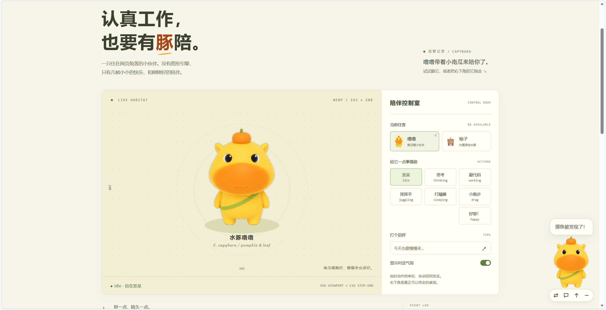
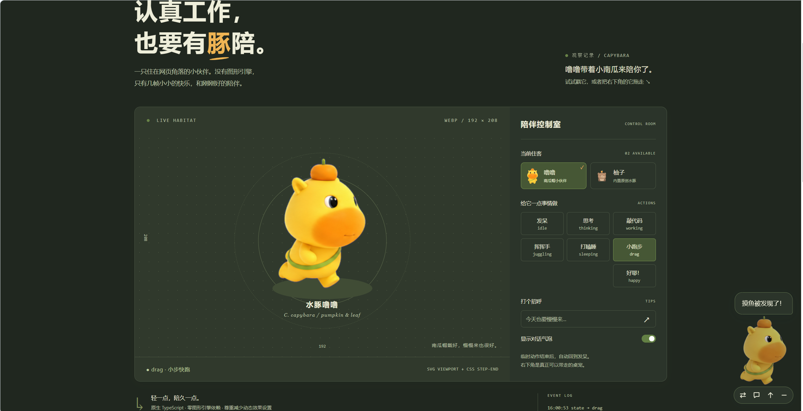

<div align="center">

# vuepress-plugin-codex-clawd-pet 🐾

> 为 **VuePress 2** 和现代网页打造的极轻量、零引擎负担桌面宠物挂件插件。
> 纯 TypeScript + SVG 视口 + CSS `step-end`，告别笨重的 Live2D 与 WebGL 内存开销。

[](LICENSE)
[](#)
[](#)
[](TESTING.md)
[](#体积性能与安全)

[在线预览 (Playground)](#playground) · [快速上手](#quick-start) · [独立核心 API](#core-api) · [配置项详解](#options) · [主题兼容规范](#theme-spec)

</div>

---

<div align="center">
  
  <p><em>☀️ 浅色模式：暖黄 + 南瓜橙 + 叶绿 主题，实时交互与状态控制室</em></p>
  <br />
  
  <p><em>🌙 深色模式：森林绿夜间暗色平滑自适应，气泡与小跑步拖拽动画</em></p>
</div>

---

传统的 `vuepress-plugin-oh-my-live2d` 虽然成熟，但 Live2D 模型普遍体积庞大（单模型 5MB ~ 30MB），且依赖 WebGL / Pixi.js 重型渲染引擎，极易导致个人博客首屏加载变慢、移动端发热卡顿。

`vuepress-plugin-codex-clawd-pet` 专为追求极致性能与清爽体验的技术博客设计：

- ⚡ **极致轻量**：核心运行时仅 **~9.6 KB (gzip)**，无任何运行时 npm 依赖（Pixi.js / Three.js 均为 0）。
- 🎨 **GPU 硬件合成**：基于标准 WebP Spritesheet 与 CSS 步进关键帧（`step-end`）/ SVG 视口驱动，丝滑且杜绝 WebGL 内存泄漏。
- 🎒 **原生兼容两大生态**：无缝解析 [Codex-Pet](https://codex-pet.org/zh/) 的 `pet.json` 与 [Clawd-on-desk](https://github.com/rullerzhou-afk/clawd-on-desk) 的 `theme.json` 主题规范。
- 💡 **全功能博客联动**：内置戳一戳、鼠标/触屏防出界自由拖拽停靠、代码块复制反馈、文章阅读里程碑进度（0% / 50% / 100%）、深色模式盖被入睡。
- 🛡️ **生产级工程鲁棒性**：完整覆盖 113 项自动化测试（覆盖率门禁 >90%），严格解耦 SSR 静态生成与 DOM 生命周期。

---

## 🚀 快速上手

### 1. 本地开始与调试

```sh
npm install
npm run dev                  # Vite 预览（默认端口 5173，终端显示实际 URL）
npm run check                # 严格 TypeScript 检查
npm test                     # 运行 113 项全套单元与 DOM 集成测试
npm run test:coverage        # V8 覆盖率与逐文件门禁 → coverage/
npm run build                # ESM + 声明文件 + 主题资源 → dist/
npm run build:playground     # 可静态托管的桌宠预览站
npm run docs:build           # 真实 VuePress SSR + /pet-docs/ 子路径构建验证
npm pack                     # 生成本地可安装的 .tgz 安装包
```

在本地站点项目中引用：
```sh
npm install /path/to/vuepress-plugin-codex-clawd-pet-0.1.0.tgz
```

---

<span id="playground"></span>
## 🎮 Playground 展示与调试

本地开发预览页默认演示用户提供的 **水豚噜噜** 🎃（南瓜帽 / 绿色小包），同时展示中央实时预览区与右下角可交互挂件：

- **主题与调色板**：主色调映射为暖黄、南瓜橙与叶绿，夜间自动平滑过渡为森林绿；气泡和工具栏同步自适应配色。
- **动态交互**：支持保留待机、挥手（waving）、跳跃（jumping）和左右跑步拖动动画；支持一键切回内置原创「柚子 / 月白」水豚。
- **移动端适配优化**：已调校 ViewBox 安全视口与内容盒 Padding，移动设备小屏浏览时头顶南瓜帽等饰品不会被裁切。
- **发布体积隔离**：噜噜的原始无损 WebP（1536 × 1872，约 1.53 MB）严格隔离在 `playground/themes/lulu/` 调试目录中，**不打包进 npm 正式发布产物**，插件核心发布包体积始终保持极限精简。
- **自定义主题变量**：支持通过宿主容器 `.codex-clawd-pet` 的 CSS 变量全局覆盖 Shadow DOM 样式：
  - 日间：`--ccp-ink`、`--ccp-focus`、`--ccp-surface`、`--ccp-border`、`--ccp-hover`
  - 夜间：`--ccp-dark-ink`、`--ccp-dark-surface`、`--ccp-dark-border`、`--ccp-dark-hover`

---

<span id="quick-start"></span>
## 📖 VuePress 2 接入

在 VuePress 配置文件中引入插件（例如 `.vuepress/config.ts`）：

```ts
import { defineUserConfig } from 'vuepress';
import { codexClawdPetPlugin } from 'vuepress-plugin-codex-clawd-pet';

export default defineUserConfig({
  // 保留站点原有的 theme / bundler 配置
  plugins: [
    codexClawdPetPlugin({
      position: 'bottom-right',
      size: 160,
      offset: { x: 24, y: 20 },
      darkMode: 'auto',
      darkBehavior: 'dim', // 或 'sleep'：夜间待机自动改为 sleeping 动作
      tips: {
        welcome: ['欢迎来到我的博客！🎃'],
        copy: '代码收好啦，灵感 +1！✨',
        reading: { 0: '开始阅读！', 50: '读到一半啦。', 100: '读完啦，撒花 🎉' },
        hitokoto: false, // 默认不请求第三方网络服务
      },
    }),
  ],
});
```

插件通过 VuePress 的 `rootComponents` 和 `<ClientOnly>` 挂载，仅在 `onMounted` 钩子中执行 DOM 初始化，SSR 构建绝对安全。挂件自动监听 `route.fullPath`，换页后自动重置阅读里程碑并优雅销毁清理，杜绝内存累积。

### 载入自定义主题包

将下载的 Codex 或 Clawd 主题文件夹放入博客的公共静态目录 `.vuepress/public/pets/`：

```text
.vuepress/public/pets/
├─ my-codex-pet/
│  ├─ pet.json
│  └─ spritesheet.webp
└─ my-clawd-pet/
   ├─ theme.json
   ├─ idle.svg
   └─ ...
```

在配置中引用：

```ts
codexClawdPetPlugin({
  themes: ['/pets/my-codex-pet/pet.json', '/pets/my-clawd-pet/theme.json'],
});
```

*注：VuePress 会为 `/pets/...` 自动补全站点的 `base` 子路径，切勿手动重复拼接。*

---

<span id="core-api"></span>
## 🧩 独立核心 (Vanilla TS)

该插件的核心渲染运行时与 VuePress 完全解耦，支持在任意普通网页、原生 HTML、React 或 VitePress 项目中独立运行：

```ts
import { CodexClawdPet } from 'vuepress-plugin-codex-clawd-pet/core';

const pet = new CodexClawdPet({
  size: 150,
  onStateChange: (state) => console.log('当前状态:', state),
  onError: (error) => console.warn('挂件异常:', error),
});

// 挂载至页面（浏览器环境）
await pet.mount();

// 编程式动作调度
pet.play('thinking', 3000); // 3 秒后自动平滑回归待机状态
pet.say('这里有一条小提示。', 4000); // 弹出纯文本气泡
await pet.nextTheme(); // 切换下一个主题
pet.setMinimized(true); // 最小化收起为胶囊
pet.setTipsEnabled(false); // 关闭气泡
pet.setDarkMode('dark'); // 强制暗黑模式
pet.notifyRouteChange(); // 非 VuePress SPA 切换路由时手动通知重置
pet.destroy(); // 实例销毁与事件彻底解绑（幂等）
```

### 核心公开 API 一览

| API 方法 | 返回类型 | 说明 |
| :--- | :--- | :--- |
| `mount(target?)` | `Promise<this>` | 挂载到指定 DOM（默认 `document.body`）；仅在浏览器端执行 |
| `play(state, duration?)` | `boolean` | 触发指定动作；未定义动作回退 idle，`duration: 0` 为持续保持 |
| `say(message, duration?)` | `void` | 弹出纯文本气泡（XSS 安全过滤，不解析 HTML），默认停留 4500ms |
| `setTheme(source)` / `nextTheme()` | `Promise<void>` | 异步切换主题；自动中止旧网络请求，清单解析失败保留原宠 |
| `setMinimized(value)` | `void` | 展开或折叠挂件 |
| `setTipsEnabled(value)` | `void` | 开启或关闭气泡消息推送 |
| `setDarkMode(mode)` | `void` | 设置昼夜模式：`'auto'` \| `'light'` \| `'dark'` |
| `notifyRouteChange()` | `void` | 手动通知页面路由切换，重置阅读里程碑 |
| `fetchQuote()` | `Promise<boolean>` | 主动拉取一言句子并展示 |
| `destroy()` | `void` | 销毁挂件、断开观察器与解绑全局事件监听器 |

---

<span id="options"></span>
## ⚙️ 配置选项（Options）

完整类型定义请参阅 [`src/core/types.ts`](src/core/types.ts)。

| 字段 | 类型 | 默认值 | 详细说明 |
| :--- | :--- | :--- | :--- |
| `theme` | `string \| PetThemeConfig` | 内置柚子 | 默认主题配置对象或清单 URL |
| `themes` | `(string \| PetThemeConfig)[]` | `['yuzu', 'yuebai']` | 工具栏轮换主题列表，配置多项时自动显示「换宠」按钮 |
| `position` | `'bottom-right' \| 'bottom-left'` | `'bottom-right'` | 初始悬浮停靠锚点 |
| `size` | `number` | `160` | 挂件基准宽度（px），自动在 48–512 之间安全钳制 |
| `offset` | `{ x: number, y: number }` | `{ x: 24, y: 20 }` | 停靠视口边缘的初始边距（px） |
| `draggable` | `boolean` | `true` | 是否支持 Pointer Events 自由拖拽 |
| `dock` | `boolean` | `true` | 松开拖拽后是否以物理缓动平滑吸附到底角 |
| `darkMode` | `'auto' \| 'light' \| 'dark'` | `'auto'` | 自动响应 HTML `.dark`、`data-theme`、系统配色偏好 |
| `darkBehavior` | `'dim' \| 'sleep'` | `'dim'` | 夜间模式动作响应：`'dim'` 柔和暗色滤镜；`'sleep'` 切换入睡动画 |
| `toolbar` | `boolean` | `true` | 是否在挂件旁展示快捷悬浮工具栏 |
| `zIndex` | `number` | `1000` | 挂件在页面中的 CSS `z-index` 层级 |
| `tips` | `boolean \| TipsOptions` | `true` | 对话气泡配置对象，设为 `false` 可完全静音 |

### 气泡提示高级配置 (`tips`)

```ts
codexClawdPetPlugin({
  tips: {
    welcome: ['欢迎来到我的博客！'], // 首页与入站欢迎语
    copy: '代码收好啦，灵感 +1！',     // 复制代码块时的反馈气泡
    reading: {                     // 阅读里程碑进度提示
      0: '开始阅读！',
      50: '读到一半啦，继续加油。',
      100: '读完全篇啦，撒花 ✨'
    },
    hitokoto: {                    // 一言服务（默认关闭）
      endpoint: 'https://v1.hitokoto.cn/',
      interval: 60000,             // 轮询间隔（最短 10s）
      timeout: 5000
    }
  }
});
```

*注：复制反馈不仅识别 `code` / `pre` 内的原生复制事件，还无缝兼容了 VuePress 常见的 `.copy-code-button`、`.vp-copy-code-button` 与 `[data-copy-code]` 点击按钮。*

---

<span id="theme-spec"></span>
## 🎨 主题兼容规范

### 1. 自定义通用图集规范

```json
{
  "id": "my-pet",
  "name": "My Pet",
  "spritesheet": "spritesheet.webp",
  "frameWidth": 192,
  "frameHeight": 208,
  "columns": 8,
  "rows": 2,
  "viewBox": [0, 0, 192, 208],
  "fps": 8,
  "actions": {
    "idle": { "frames": [0, 1, 2, 3] },
    "thinking": { "frames": [8, 9, 10, 11], "duration": 3000 },
    "happy": { "frames": [4, 5, 6], "frameDurations": [140, 140, 280], "loop": false }
  }
}
```

- **帧序列优先**：帧索引起始于 0，支持跨行映射、倒序排列与指定帧持续时间 `frameDurations`。
- **状态调度器机制**：支持非负数 `priority` 与 `interruptible: false` 优先级抢占调度，不可打断动作执行期间自动丢弃低优触发，防止疯狂连点造成状态混乱。
- **渲染零计算**：基于 SVG 视口映射与负原点 ViewBox，缩放和偏移完全交给浏览器图形管线，无需 JS 逐帧计算位移。

### 2. Codex `pet.json` 官方规范对齐

无缝支持 Codex 社区标准 `spriteVersionNumber` 规范（包括水豚噜噜等经典模型）：

| 插件内部动作 | Codex 图集动作行号 | 说明 |
| :--- | :--- | :--- |
| `idle` | Row 0 | 待机动作（6 帧） |
| `drag-right` / `drag-left` | Row 1 / Row 2 | 左右奔跑拖拽动作 |
| `juggling` | Row 3 | 挥手打招呼动作（waving） |
| `happy` / `attention` | Row 4 | 雀跃跳跃动作（jumping） |
| `error` | Row 5 | 失败/沮丧反馈动作（failed） |
| `notification` | Row 6 | 等待反馈动作（waiting） |
| `working` | Row 7 | 快速奔跑状态（running） |
| `thinking` | Row 8 | 思考审查状态（review） |
| `sleeping` | 静态首帧回退 | 兼容回退 |

### 3. Clawd `theme.json` 规范对齐

支持 `schemaVersion: 1`、`viewBox: { x, y, width, height }`、`states` 与 `reactions` 事件驱动映射。

---

## 🔒 体积、性能与安全保证

1. **真实体积口径**：
   - 核心纯 JS bundle 经 esbuild 压缩后为 27.6 KB，**gzip 后仅 9,680 bytes**。
   - 内置原创水豚「柚子」无损 WebP 仅 46 KB，「月白」SVG 仅 35 KB。
2. **硬件渲染开销**：
   - 基于 CSS Keyframes 变换 SVG `<image>` 矩阵，`step-end` 离散切帧，**无逐帧 JS 定时器**。
   - 页面不可见（Tab 切出）或挂件最小化时，动画自动冻结暂停；完美遵守操作系统的 `prefers-reduced-motion` 减弱动画偏好。
3. **内容安全（Security）**：
   - 气泡文本严格采用 `textContent` 写入，彻底阻隔 XSS 跨站脚本；禁止 `javascript:`、`file:` 等不安全协议。
   - 外部网络清单支持请求超时熔断（默认 15s），实例清理时一键中止。
   - 采用 Shadow DOM 物理隔离站点 CSS 样式污染。

---

## 🧪 测试与质量验证

完整测试体系请查阅 [TESTING.md](TESTING.md)。

本项目配置了 Vitest + jsdom + DOM Testing Library 自动化测试矩阵：
- **113 项全量自动化测试** 全部绿灯通过。
- 覆盖率硬性门禁：语句覆盖率 >90%，分支覆盖率 >80%。
- 严格验证生命周期与定时器销毁断言，杜绝任何内存泄露。

---

## 📄 开源许可

- 源代码与内置原创水豚模型采用 **Apache-2.0** 许可协议。
- 第三方 Codex / Clawd 主题素材不随 npm 包公开发布，其所有权与肖像权归各原作者所有。
- 本项目为独立开源实现，不代表上游 Codex / Clawd 官方团队。
